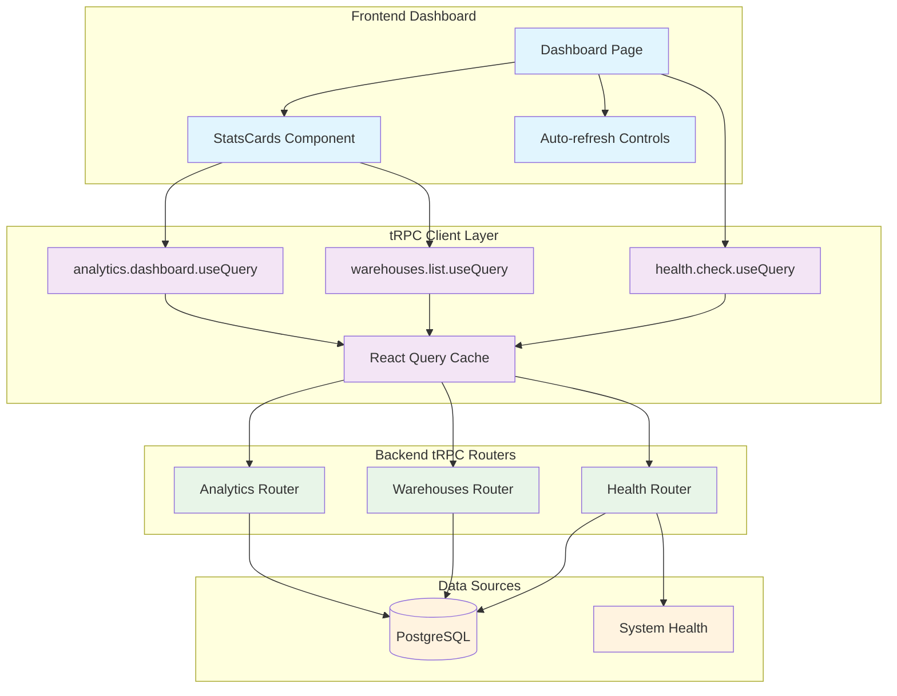

# Ventry Architecture Overview

## System Architecture

Ventry is built as a modern monorepo application using microservices principles while maintaining the simplicity of a monolithic deployment during development.

```mermaid
graph TB
    subgraph "Frontend"
        WEB[Next.js Web App<br/>Port: 6061]
        PROXY[Next.js Proxy<br/>/api/trpc/*]
        UI[Shared UI Components]
    end
    
    subgraph "Backend Services"
        API[tRPC + Fastify Server<br/>Port: 6060]
        AUTH[Auth Router]
        USERS[Users Router]
        PRODUCTS[Products Router]
        ANALYTICS[Analytics Router<br/>Live Dashboard Data]
        HEALTH[Health Router<br/>System Monitoring]
        AGENTS[AI Agents<br/>(Future)]
    end
    
    subgraph "Data Layer"
        DB[(PostgreSQL)]
        PRISMA[Prisma ORM]
    end
    
    subgraph "External Services"
        AI[AI Providers<br/>OpenAI/Anthropic]
        EMAIL[Email Service<br/>(Planned)]
        SENTRY[Sentry Monitoring]
    end
    
    WEB --> PROXY
    PROXY --> API
    API --> PRISMA
    PRISMA --> DB
    API --> SENTRY
    AGENTS --> AI
```

## Technology Stack

### Frontend
- **Framework**: Next.js 15 with App Router
- **Language**: TypeScript
- **Styling**: Tailwind CSS
- **UI Components**: shadcn/ui
- **State Management**: React Context + TanStack Query
- **Real-time**: Socket.io client
- **Forms**: React Hook Form + Zod

### Backend
- **Framework**: tRPC + Fastify
- **Language**: TypeScript (strict mode)
- **Database**: PostgreSQL 16 with Prisma ORM
- **Multi-tenant**: Full organizationId scoping across all entities
- **Authentication**: JWT with httpOnly cookies + organization context
- **API Layer**: tRPC v11 with factory pattern architecture
- **Middleware**: Clean separation using factory pattern (no circular deps)
- **Real-time**: WebSocket support via Fastify (Supabase-ready)
- **Caching**: Redis (planned)
- **Queue**: Bull (planned)

### Infrastructure
- **Monorepo**: Turborepo
- **Package Manager**: pnpm
- **Containerization**: Docker
- **CI/CD**: GitHub Actions
- **Monitoring**: OpenTelemetry ready

## Core Design Principles

### 1. AI-Native Architecture
- AI agents are first-class citizens
- Every major decision can be augmented by AI
- Human-in-the-loop for critical operations
- Transparent AI decision logging

### 2. Event-Driven Design
- Loose coupling between modules
- Asynchronous processing for heavy operations
- Real-time updates via WebSockets
- Event sourcing for audit trails

### 3. Domain-Driven Design
- Clear bounded contexts (Inventory, Users, AI Agents)
- Rich domain models
- Repository pattern for data access
- Use cases encapsulated in services

### 4. Security First
- Input validation at all layers
- Role-based access control (RBAC)
- API rate limiting
- Audit logging for all operations

## Dashboard Data Flow Architecture

The dashboard implements a real-time data architecture using tRPC with auto-refresh functionality for live inventory insights.

### Data Flow Diagram



### Auto-Refresh Implementation

#### Component Level Auto-Refresh

```typescript
// StatsCards Component Pattern
export function StatsCards({ refreshInterval = 30000 }: StatsCardsProps) {
  const { data: analytics, isLoading, error } = trpc.analytics.dashboard.useQuery({
    period: 'last30days',
    includeAllWarehouses: true,
  }, {
    refetchInterval: refreshInterval,        // 30-second intervals
    refetchIntervalInBackground: true,       // Continue when tab inactive
  });
}
```

#### Page Level Controls

```typescript
// Dashboard Page Auto-Refresh Controls
export default function DashboardPage() {
  const [autoRefresh, setAutoRefresh] = useState(true);
  const refreshInterval = 30000;
  
  // Health monitoring with auto-refresh
  const { data: health, refetch: refetchHealth } = trpc.health.check.useQuery(undefined, {
    refetchInterval: autoRefresh ? refreshInterval : false,
    refetchIntervalInBackground: true,
  });
}
```

### Data Sources and Endpoints

#### Analytics Router Endpoints
- **`analytics.dashboard`**: Main inventory metrics, operations data
- **Input**: `{ period, includeAllWarehouses, warehouseIds?, categoryIds? }`
- **Output**: Inventory totals, operations counts, low stock alerts

#### Warehouses Router Endpoints  
- **`warehouses.list`**: Warehouse and location counts
- **Input**: `{ search, limit, includeLocationCount }`
- **Output**: Warehouse data with location counts for dashboard cards

#### Health Router Endpoints
- **`health.check`**: System status monitoring
- **Input**: None
- **Output**: API status, database connection, environment info, timestamps

### Performance Considerations

#### Query Optimization
- **Parallel Queries**: Multiple tRPC queries execute concurrently
- **Background Refresh**: Queries continue when browser tab inactive
- **Caching**: React Query provides automatic caching and deduplication
- **Selective Updates**: Only changed data triggers re-renders

#### User Experience
- **Manual Override**: Users can manually trigger refresh
- **Toggle Controls**: Auto-refresh can be disabled per user preference
- **Loading States**: Skeleton loaders during initial load
- **Error Boundaries**: Graceful degradation when endpoints fail

### Extending Dashboard

To add new real-time dashboard features:

1. **Backend**: Add new analytics procedures to `analytics.ts` router
2. **Frontend**: Create components following `StatsCards` auto-refresh pattern
3. **Data Flow**: Use `refetchInterval` for live updates
4. **Performance**: Consider query performance impact with large datasets

## tRPC Router Architecture

### Backend Routers

#### Core Routers
1. **AppRouter**: Root router combining all sub-routers
2. **authRouter**: Authentication procedures (login, register, logout, refresh)
3. **healthRouter**: System health checks and monitoring
4. **organizationsRouter**: Multi-tenant organization management

#### Business Logic Routers
1. **itemsRouter**: Product/item catalog management
2. **warehousesRouter**: Warehouse and location hierarchy
3. **inventoryRouter**: Stock levels and movements
4. **stockMovementsRouter**: Detailed movement tracking
5. **suppliersRouter**: Supplier relationship management
6. **customersRouter**: Customer management and credit tracking
7. **ordersRouter**: Sales order processing
8. **purchaseOrdersRouter**: Procurement workflows
9. **returnsRouter**: RMA and return processing
10. **shipmentsRouter**: Delivery tracking
11. **reportsRouter**: Analytics and reporting
12. **analyticsRouter**: Real-time dashboards
13. **categoriesRouter**: Product categorization

### Frontend Structure

```
app/
├── (auth)/          # Authentication pages
├── (dashboard)/     # Main application
│   ├── dashboard/   # Overview & analytics
│   ├── inventory/   # Inventory management
│   ├── products/    # Product catalog
│   ├── suppliers/   # Supplier management
│   ├── chat/       # AI chat interface
│   └── settings/   # User & system settings
└── api/            # API routes (if needed)
```

## Data Flow

### Request Flow
1. Client makes request to Next.js app
2. Next.js app calls tRPC API
3. API validates request (DTO validation)
4. API checks authentication/authorization
5. Service layer processes business logic
6. Repository layer handles data access
7. Response transformed and returned

### Real-time Updates
1. Client establishes WebSocket connection
2. Server emits events on data changes
3. Client updates UI optimistically
4. Server confirms or corrects state

### AI Agent Flow
1. Trigger event (manual or automated)
2. Agent service prepares context
3. LLM call with structured prompt
4. Response parsing and validation
5. Action execution
6. Result logging and notification

## tRPC Architecture Pattern

### Factory Pattern Implementation
```
src/trpc/
├── builder.ts       # tRPC instance creation (no local imports)
├── middleware.ts    # Middleware factory functions
├── procedures.ts    # Base procedures using middleware
├── trpc.ts         # Main export combining everything
└── context.ts      # Context creation with auth
```

### Why Factory Pattern?
- **No Circular Dependencies**: Each file has clear one-way dependencies
- **Separation of Concerns**: Single responsibility per file
- **Testability**: Easy to mock individual components
- **Type Safety**: Full TypeScript inference preserved
- **Best Practices**: Follows tRPC and T3 stack patterns

## Database Schema Design

### Multi-Tenant Architecture
- **Organization**: Top-level tenant entity
- **OrganizationMember**: User-organization relationships with roles
- **All Business Entities**: Include organizationId for data isolation

### Core Entities (40+ tables)
- **Item**: Inventory items (formerly Product)
- **ItemCategory**: Hierarchical categorization
- **Warehouse**: Physical locations
- **Location**: Specific storage spots (aisle/shelf/bin)
- **Inventory**: Current stock levels by item/location
- **StockMovement**: Complete movement history
- **Supplier**: Vendor management
- **PurchaseOrder**: Procurement workflow
- **Customer**: Client management
- **Order**: Sales orders
- **Shipment**: Delivery tracking
- **Return**: RMA process

## Security Architecture

### Authentication Flow
1. User logs in with credentials
2. Server validates and generates JWT
3. JWT stored in httpOnly cookie (secure)
4. Cookie automatically sent with requests (credentials: 'include')
5. Server validates JWT from cookie and authorizes

### Cookie-Based Authentication
- **JWT Storage**: httpOnly cookies prevent XSS attacks
- **Same-Origin Requests**: Next.js proxy ensures cookies work in development
- **Cookie Settings**: `SameSite=Lax`, `HttpOnly`, `Secure` (in production)
- **Automatic Handling**: No manual token management in frontend

### API Proxy Pattern
```typescript
// next.config.ts
async rewrites() {
  return [{
    source: '/api/trpc/:path*',
    destination: 'http://localhost:6060/trpc/:path*',
  }];
}
```

**Why Proxy?**
- Browsers block cross-origin cookies (even different ports)
- Proxy makes all requests appear from same origin (localhost:6061)
- Enables secure httpOnly cookie authentication in development
- Production uses same pattern with proper domain configuration

### Data Protection
- Encryption at rest (database)
- Encryption in transit (HTTPS)
- Sensitive data masking in logs
- PII handling compliance

## Deployment Architecture

### Development
- Docker Compose for local services
- Hot reloading for all apps
- Shared volumes for code

### Production
- Containerized applications
- Horizontal scaling capability
- Load balancer for API
- CDN for static assets
- Database connection pooling

## Performance Considerations

### Backend
- Database query optimization
- Redis caching strategy
- Background job processing
- Connection pooling

### Frontend
- Code splitting
- Image optimization
- Static generation where possible
- Progressive enhancement

## Technical Decisions & Trade-offs

### ESLint Configuration Strategy

Due to incompatibility between Next.js 15 (requires ESLint 9) and eslint-config-next (uses TypeScript ESLint v6), we maintain a custom ESLint configuration:

**Decision**: Use TypeScript ESLint v8 with custom flat config instead of Next.js defaults
**Rationale**: Enables Next.js 15 adoption while maintaining type-safe linting
**Impact**: 
- Lose some Next.js-specific linting rules
- Gain compatibility with latest tooling
- Must maintain custom configuration

**Migration Path**: Return to standard Next.js ESLint config when official ESLint 9 support is released.

## Monitoring & Observability

### Metrics
- Application performance
- API response times
- Database query performance
- AI agent execution metrics

### Logging
- Structured JSON logging
- Correlation IDs for tracing
- Error aggregation
- Security event logging

### Alerting
- Performance degradation
- Error rate thresholds
- Security incidents
- Business metric anomalies