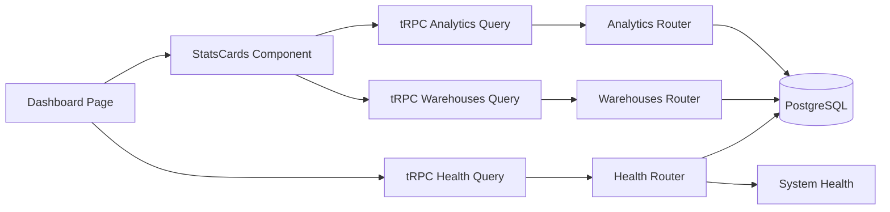

# Dashboard Documentation

## Overview

The Ventry dashboard provides real-time inventory insights through live data integration with auto-refresh functionality. It connects directly to backend analytics endpoints to display current inventory metrics, system health, and operational statistics.

## Features

### Live Data Integration

The dashboard displays real-time data from the following sources:

- **Inventory Analytics**: Live inventory metrics including total products, inventory value, and low stock alerts
- **Warehouse Data**: Real-time location counts and warehouse statistics  
- **System Health**: API status, database connectivity, and system performance metrics
- **Operations Data**: Recent inventory movements, receipts, shipments, and transfers

### Auto-Refresh Functionality

- **30-Second Intervals**: Dashboard automatically refreshes every 30 seconds by default
- **Background Updates**: Continues updating even when browser tab is not active
- **User Controls**: Manual refresh button and auto-refresh toggle
- **Configurable**: Refresh intervals can be customized per component

### User Interface

- **Real-time Cards**: Six main dashboard cards showing key inventory metrics
- **System Status Panel**: Live API and database connection monitoring
- **Quick Actions**: Direct links to inventory, products, and movements pages
- **Responsive Design**: Works across desktop, tablet, and mobile devices

## Architecture

### Component Structure

```
apps/web/
├── app/dashboard/
│   └── page.tsx                     # Main dashboard page with controls
├── components/dashboard/
│   └── stats-cards.tsx             # Live analytics cards component
└── components/layout/
    └── dashboard-layout.tsx        # Shared dashboard layout
```

### Data Flow



### tRPC Integration

The dashboard uses three main tRPC endpoints:

#### 1. Analytics Dashboard (`trpc.analytics.dashboard`)

**Purpose**: Main inventory and operations metrics

**Input Schema**:
```typescript
{
  period: 'last30days' | 'last7days' | 'last90days' | 'custom'
  includeAllWarehouses: boolean
  warehouseIds?: string[]
  categoryIds?: string[]
  compareWith?: 'previous' | 'lastYear' | 'none'
}
```

**Output Data**:
- `entities.activeItems`: Total number of active products
- `inventory.totalOnHand`: Total inventory quantity
- `inventory.totalValue`: Total inventory value in currency
- `inventory.lowStockItems`: Count of items below reorder point
- `operations.receipts`: Recent receipt operations
- `operations.shipments`: Recent shipment operations  
- `operations.transfers`: Recent transfer operations

#### 2. Warehouses List (`trpc.warehouses.list`)

**Purpose**: Warehouse and location counts

**Input Schema**:
```typescript
{
  search: string
  limit: number
  includeLocationCount: boolean
}
```

**Output Data**:
- `warehouses[]`: Array of warehouse objects
- `warehouses[].locationCount`: Number of locations per warehouse

#### 3. Health Check (`trpc.health.check`)

**Purpose**: System status monitoring

**Output Data**:
- `services.api`: API service status ('healthy' | 'unhealthy')
- `services.database.status`: Database connection ('connected' | 'disconnected')
- `services.database.error`: Database error message if any
- `timestamp`: Last check timestamp
- `environment`: Current environment (development/production)

## Implementation Guide

### Basic Dashboard Component

```typescript
'use client';

import { useState } from 'react';
import { trpc } from '@/lib/trpc';
import { Button } from '@ventry/ui';
import { RefreshCw } from 'lucide-react';

export default function DashboardPage() {
  const [autoRefresh, setAutoRefresh] = useState(true);
  const refreshInterval = 30000; // 30 seconds

  // Health monitoring with auto-refresh
  const { data: health, isLoading, refetch } = trpc.health.check.useQuery(undefined, {
    refetchInterval: autoRefresh ? refreshInterval : false,
    refetchIntervalInBackground: true,
  });

  return (
    <div className="space-y-6">
      <div className="flex items-center justify-between">
        <h1 className="text-3xl font-bold">Dashboard</h1>
        <div className="flex items-center gap-2">
          <Button onClick={() => refetch()} disabled={isLoading}>
            <RefreshCw className={isLoading ? 'animate-spin' : ''} />
            Refresh
          </Button>
          <Button 
            variant={autoRefresh ? 'default' : 'outline'}
            onClick={() => setAutoRefresh(!autoRefresh)}
          >
            Auto-refresh {autoRefresh ? 'ON' : 'OFF'}
          </Button>
        </div>
      </div>
      
      {/* Dashboard content */}
    </div>
  );
}
```

### Stats Cards with Auto-Refresh

```typescript
'use client';

import { Card, CardContent, CardHeader, CardTitle } from '@ventry/ui';
import { Package, Box, Building } from 'lucide-react';
import { trpc } from '@/lib/trpc';

interface StatsCardsProps {
  refreshInterval?: number;
}

export function StatsCards({ refreshInterval = 30000 }: StatsCardsProps) {
  // Live analytics data with auto-refresh
  const { data: analytics, isLoading, error } = trpc.analytics.dashboard.useQuery({
    period: 'last30days',
    includeAllWarehouses: true,
  }, {
    refetchInterval: refreshInterval,
    refetchIntervalInBackground: true,
  });

  // Warehouse location counts
  const { data: warehouses } = trpc.warehouses.list.useQuery({
    search: '',
    limit: 1000,
  }, {
    refetchInterval: refreshInterval,
    refetchIntervalInBackground: true,
  });

  if (isLoading) {
    return <LoadingSkeleton />;
  }

  if (error) {
    return <ErrorDisplay error={error} />;
  }

  const totalLocations = warehouses?.warehouses?.reduce(
    (sum, warehouse) => sum + (warehouse.locationCount || 0), 0
  ) || 0;

  const cards = [
    {
      title: 'Total Products',
      value: analytics?.entities?.activeItems || 0,
      icon: Package,
      description: 'Active products in catalog',
    },
    {
      title: 'Total Locations', 
      value: totalLocations,
      icon: Building,
      description: 'Storage locations',
    },
    {
      title: 'Total Inventory',
      value: analytics?.inventory?.totalOnHand || 0,
      icon: Box,
      description: 'Items on hand',
    },
  ];

  return (
    <div className="grid grid-cols-1 md:grid-cols-3 gap-6">
      {cards.map((card) => {
        const Icon = card.icon;
        return (
          <Card key={card.title}>
            <CardHeader className="flex flex-row items-center justify-between">
              <CardTitle className="text-sm font-medium">{card.title}</CardTitle>
              <Icon className="h-4 w-4 text-blue-600" />
            </CardHeader>
            <CardContent>
              <div className="text-2xl font-bold">
                {card.value.toLocaleString()}
              </div>
              <p className="text-xs text-muted-foreground">{card.description}</p>
            </CardContent>
          </Card>
        );
      })}
    </div>
  );
}
```

## Configuration

### Refresh Intervals

Default refresh intervals can be configured:

```typescript
// Default: 30 seconds
const DEFAULT_REFRESH_INTERVAL = 30000;

// Fast refresh for critical data: 10 seconds  
const FAST_REFRESH_INTERVAL = 10000;

// Slow refresh for static data: 2 minutes
const SLOW_REFRESH_INTERVAL = 120000;
```

### Query Options

React Query options for dashboard queries:

```typescript
const queryOptions = {
  refetchInterval: refreshInterval,           // Refresh interval in ms
  refetchIntervalInBackground: true,          // Continue when tab inactive
  staleTime: 5000,                           // Consider data stale after 5 seconds
  cacheTime: 60000,                          // Cache for 1 minute
  retry: 3,                                  // Retry failed queries 3 times
  retryDelay: attemptIndex => Math.min(1000 * 2 ** attemptIndex, 30000),
};
```

## Performance Considerations

### Query Optimization

1. **Parallel Execution**: Multiple tRPC queries execute concurrently
2. **Selective Data**: Fetch only required fields for dashboard display
3. **Caching**: React Query provides automatic caching and deduplication
4. **Background Updates**: Queries continue when browser tab is inactive

### Database Performance

1. **Indexed Queries**: Ensure analytics queries use proper database indexes
2. **Aggregation**: Use database-level aggregation for summary statistics
3. **Connection Pooling**: Prisma connection pooling for concurrent queries
4. **Query Batching**: Combine related queries where possible

### User Experience

1. **Loading States**: Show skeleton loaders during initial data load
2. **Error Boundaries**: Graceful degradation when endpoints fail
3. **Progressive Enhancement**: Core functionality works without JavaScript
4. **Responsive Design**: Optimized for all screen sizes

## Testing

### Unit Testing

Test dashboard components with mocked tRPC queries:

```typescript
import { render, screen } from '@testing-library/react';
import { StatsCards } from './stats-cards';
import { trpc } from '@/lib/trpc';

// Mock tRPC
jest.mock('@/lib/trpc');
const mockTrpc = trpc as jest.Mocked<typeof trpc>;

describe('StatsCards', () => {
  it('displays analytics data correctly', () => {
    mockTrpc.analytics.dashboard.useQuery.mockReturnValue({
      data: {
        entities: { activeItems: 150 },
        inventory: { totalOnHand: 1247, totalValue: 15890 },
      },
      isLoading: false,
      error: null,
    });

    render(<StatsCards />);
    
    expect(screen.getByText('150')).toBeInTheDocument();
    expect(screen.getByText('Total Products')).toBeInTheDocument();
  });
});
```

### Integration Testing

Test with real tRPC endpoints:

```typescript
import { createIntegrationContext } from '../test-utils/trpc-test-client';
import { appRouter } from '../routers/_app';

describe('Dashboard Analytics', () => {
  it('returns valid dashboard data', async () => {
    const ctx = await createIntegrationContext();
    const caller = appRouter.createCaller(ctx);

    const result = await caller.analytics.dashboard({
      period: 'last30days',
      includeAllWarehouses: true,
    });

    expect(result.entities.activeItems).toBeGreaterThanOrEqual(0);
    expect(result.inventory.totalValue).toBeGreaterThanOrEqual(0);
  });
});
```

### E2E Testing

Test complete dashboard functionality:

```typescript
import { test, expect } from '@playwright/test';

test('dashboard displays live data', async ({ page }) => {
  await page.goto('/dashboard');
  
  // Wait for dashboard to load
  await expect(page.locator('h1')).toContainText('Dashboard');
  
  // Check that data cards are displayed
  await expect(page.locator('[data-testid="total-products"]')).toBeVisible();
  await expect(page.locator('[data-testid="inventory-value"]')).toBeVisible();
  
  // Test auto-refresh toggle
  await page.click('[data-testid="auto-refresh-toggle"]');
  await expect(page.locator('text=Auto-refresh OFF')).toBeVisible();
});
```

## Troubleshooting

### Common Issues

#### 1. Dashboard Shows No Data

**Symptoms**: Dashboard cards show 0 values or "No data available"

**Causes**:
- Database not seeded with demo data
- User not logged in or no organization access
- Analytics router returning empty results

**Solutions**:
```bash
# Seed database with demo data
pnpm --filter @ventry/database db:seed:comprehensive

# Check user organization membership
# Ensure demo users (admin@ventry.com, manager@ventry.com) have organization access
```

#### 2. Auto-Refresh Not Working

**Symptoms**: Dashboard doesn't update automatically

**Causes**:
- Auto-refresh disabled
- Browser tab suspended (mobile Safari)
- Network connectivity issues

**Solutions**:
- Check auto-refresh toggle is ON
- Use manual refresh button to test connectivity
- Check browser dev tools Network tab for failed requests

#### 3. Slow Dashboard Performance

**Symptoms**: Dashboard takes long time to load or update

**Causes**:
- Large dataset queries
- Missing database indexes
- Network latency

**Solutions**:
- Optimize analytics queries with proper indexes
- Consider pagination for large datasets
- Implement query result caching

### Debugging

Enable verbose logging for dashboard queries:

```typescript
// Add to dashboard components for debugging
const { data, isLoading, error } = trpc.analytics.dashboard.useQuery(input, {
  ...options,
  onSuccess: (data) => console.log('Dashboard data loaded:', data),
  onError: (error) => console.error('Dashboard error:', error),
});
```

Check network requests in browser dev tools:
1. Open Developer Tools (F12)
2. Go to Network tab  
3. Filter by "trpc" to see dashboard API calls
4. Check for failed requests or slow response times

## Future Enhancements

### Planned Features

1. **Custom Dashboards**: User-configurable dashboard layouts
2. **Real-time WebSockets**: Push notifications for critical events
3. **Advanced Charts**: Time-series graphs and trend analysis
4. **Export Functionality**: Download dashboard data as PDF/Excel
5. **Mobile App**: Native mobile dashboard application

### Technical Improvements

1. **Query Optimization**: Implement more efficient aggregation queries
2. **Caching Layer**: Redis caching for frequently accessed analytics
3. **Streaming Data**: WebSocket-based real-time updates
4. **Performance Monitoring**: Track dashboard query performance metrics

## Contributing

When contributing to dashboard features:

1. **Follow Patterns**: Use existing auto-refresh patterns for consistency
2. **Performance First**: Consider query performance impact
3. **Error Handling**: Always include loading states and error boundaries
4. **Testing**: Add unit, integration, and E2E tests for new features
5. **Documentation**: Update this documentation for new dashboard features