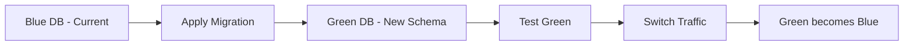

# Database Migration Strategy

This document outlines the comprehensive strategy for managing database migrations in the Ventry platform, including development workflows, production deployment procedures, and rollback strategies.

## Table of Contents

1. [Migration Overview](#migration-overview)
2. [Development Workflow](#development-workflow)
3. [Migration Best Practices](#migration-best-practices)
4. [Production Deployment](#production-deployment)
5. [Zero-Downtime Migrations](#zero-downtime-migrations)
6. [Rollback Procedures](#rollback-procedures)
7. [Data Migration Patterns](#data-migration-patterns)
8. [Testing Strategies](#testing-strategies)
9. [Monitoring & Validation](#monitoring--validation)

---

## Migration Overview

### Current State

- **ORM**: Prisma 6.11.1
- **Database**: PostgreSQL 16
- **Migration Tool**: Prisma Migrate
- **Schema Location**: `/packages/database/prisma/schema.prisma`
- **Migration History**: `/packages/database/prisma/migrations/`

### Migration Principles

1. **Backward Compatibility**: Migrations must be backward compatible for zero-downtime deployments
2. **Idempotency**: Migrations should be safe to run multiple times
3. **Atomicity**: Each migration should be a complete, atomic change
4. **Reversibility**: Every migration should have a rollback plan
5. **Performance**: Consider impact on large tables

---

## Development Workflow

### 1. Creating Migrations

**Step 1: Modify Schema**

```prisma
// packages/database/prisma/schema.prisma
model Item {
  id              String   @id @default(uuid())
  // Adding new field
  barcode         String?  @db.VarChar(50)
  // Adding index
  @@index([organizationId, barcode])
}
```

**Step 2: Create Migration**

```bash
# Navigate to database package
cd packages/database

# Create migration with descriptive name
pnpm prisma migrate dev --name add_item_barcode_field

# This will:
# 1. Generate SQL migration file
# 2. Apply migration to development database
# 3. Regenerate Prisma Client
```

**Step 3: Review Generated SQL**

```sql
-- packages/database/prisma/migrations/20240115_add_item_barcode_field/migration.sql
-- Review and optimize if needed
ALTER TABLE "items" ADD COLUMN "barcode" VARCHAR(50);
CREATE INDEX "items_organization_id_barcode_idx" ON "items"("organization_id", "barcode");
```

### 2. Migration Naming Conventions

```
YYYYMMDDHHMMSS_descriptive_name
```

Examples:

- `20240115120000_add_barcode_to_items`
- `20240116090000_create_audit_log_table`
- `20240117150000_add_inventory_indexes`

### 3. Local Development Commands

```bash
# Create new migration
pnpm prisma migrate dev --name <migration_name>

# Apply pending migrations
pnpm prisma migrate dev

# Reset database (WARNING: Data loss)
pnpm prisma migrate reset

# Check migration status
pnpm prisma migrate status

# Create migration without applying (SQL only)
pnpm prisma migrate dev --create-only --name <migration_name>
```

---

## Migration Best Practices

### 1. Schema Changes

**Safe Operations** (No downtime):

```sql
-- Adding nullable columns
ALTER TABLE items ADD COLUMN barcode VARCHAR(50);

-- Adding indexes (use CONCURRENTLY in production)
CREATE INDEX CONCURRENTLY idx_items_barcode ON items(barcode);

-- Adding tables
CREATE TABLE new_feature (...);
```

**Unsafe Operations** (Require careful planning):

```sql
-- DON'T: Drop columns immediately
ALTER TABLE items DROP COLUMN old_field;

-- DO: Mark as deprecated first, drop later
ALTER TABLE items RENAME COLUMN old_field TO deprecated_old_field;

-- DON'T: Rename columns directly
ALTER TABLE items RENAME COLUMN qty TO quantity;

-- DO: Add new column, migrate data, drop old
ALTER TABLE items ADD COLUMN quantity INTEGER;
UPDATE items SET quantity = qty;
-- Later migration: DROP COLUMN qty
```

### 2. Index Management

**Creating Indexes Safely:**

```sql
-- Development migration
CREATE INDEX idx_orders_status ON orders(status);

-- Production migration (non-blocking)
CREATE INDEX CONCURRENTLY idx_orders_status ON orders(status);
```

**Index Creation Script:**

```typescript
// tools/scripts/create-indexes.ts
async function createIndexSafely(indexName: string, definition: string) {
  try {
    // Check if index exists
    const exists = await prisma.$queryRaw`
      SELECT 1 FROM pg_indexes 
      WHERE indexname = ${indexName}
    `;

    if (!exists.length) {
      console.log(`Creating index ${indexName}...`);
      await prisma.$executeRawUnsafe(`
        CREATE INDEX CONCURRENTLY ${indexName} ${definition}
      `);
      console.log(`Index ${indexName} created successfully`);
    }
  } catch (error) {
    console.error(`Failed to create index ${indexName}:`, error);
  }
}
```

### 3. Data Type Changes

**Safe Type Migrations:**

```sql
-- Expanding column size (safe)
ALTER TABLE items ALTER COLUMN name TYPE VARCHAR(500);

-- Changing types (requires migration)
-- Step 1: Add new column
ALTER TABLE orders ADD COLUMN total_amount_decimal DECIMAL(10,2);

-- Step 2: Migrate data
UPDATE orders SET total_amount_decimal = total_amount::DECIMAL(10,2);

-- Step 3: Switch columns (in next deployment)
ALTER TABLE orders RENAME COLUMN total_amount TO total_amount_old;
ALTER TABLE orders RENAME COLUMN total_amount_decimal TO total_amount;

-- Step 4: Drop old column (after verification)
ALTER TABLE orders DROP COLUMN total_amount_old;
```

---

## Production Deployment

### 1. Pre-Deployment Checklist

```markdown
## Migration Checklist: [Migration Name]

### Pre-Deployment

- [ ] Migration tested on staging environment
- [ ] Performance impact assessed on production-size data
- [ ] Rollback script prepared and tested
- [ ] Backup completed and verified
- [ ] Maintenance window scheduled (if required)
- [ ] Team notified of deployment

### Compatibility Checks

- [ ] New code works with old schema
- [ ] Old code works with new schema
- [ ] No breaking changes to API
- [ ] Client applications compatible

### Performance Validation

- [ ] Migration time estimated: **\_** minutes
- [ ] Table locks required: Yes/No
- [ ] Index creation method: CONCURRENT/STANDARD
- [ ] Expected impact on queries: **\_**
```

### 2. Deployment Script

```bash
#!/bin/bash
# deploy-migration.sh

set -e

echo "Starting database migration deployment..."

# 1. Backup current database
echo "Creating backup..."
pg_dump $DATABASE_URL > backup_$(date +%Y%m%d_%H%M%S).sql

# 2. Check current migration status
echo "Checking migration status..."
pnpm prisma migrate status

# 3. Deploy migrations
echo "Applying migrations..."
pnpm prisma migrate deploy

# 4. Verify migrations
echo "Verifying migrations..."
pnpm prisma migrate status

# 5. Run validation queries
echo "Running validation..."
psql $DATABASE_URL < validation/post_migration_checks.sql

echo "Migration deployment completed successfully!"
```

### 3. Production Migration Commands

```bash
# Deploy pending migrations (production)
NODE_ENV=production pnpm prisma migrate deploy

# Generate migration SQL without applying
pnpm prisma migrate diff \
  --from-schema-datamodel prisma/schema.prisma \
  --to-schema-datasource prisma/schema.prisma \
  --script > migration.sql

# Apply custom SQL migration
psql $DATABASE_URL < custom_migration.sql

# Mark migration as applied (when applied manually)
pnpm prisma migrate resolve --applied "20240115120000_migration_name"
```

---

## Zero-Downtime Migrations

### 1. Blue-Green Migration Pattern



**Implementation:**

```typescript
// tools/scripts/blue-green-migration.ts
async function blueGreenMigration() {
  // 1. Create green database
  await createDatabase('ventry_green');

  // 2. Copy data from blue
  await pg_dump('ventry_blue', 'ventry_green');

  // 3. Apply migrations to green
  process.env.DATABASE_URL = greenDbUrl;
  await prisma.$executeRaw`SELECT pg_advisory_lock(1)`;
  await deployMigrations();

  // 4. Set up replication
  await setupLogicalReplication('ventry_blue', 'ventry_green');

  // 5. Validate green database
  await runValidationTests('ventry_green');

  // 6. Switch application to green
  await updateConnectionPool(greenDbUrl);

  // 7. Stop replication after stability
  await stopReplication();
}
```

### 2. Expand-Contract Pattern

**Phase 1: Expand**

```sql
-- Add new column alongside old
ALTER TABLE users ADD COLUMN email_address VARCHAR(255);

-- Sync data (handled by application)
UPDATE users SET email_address = email WHERE email_address IS NULL;
```

**Application Code (Dual Write):**

```typescript
// Write to both columns during transition
await prisma.user.update({
  where: { id },
  data: {
    email: newEmail, // Old column
    emailAddress: newEmail, // New column
  },
});
```

**Phase 2: Contract**

```sql
-- After all code deployed and data migrated
ALTER TABLE users DROP COLUMN email;
```

### 3. Online Schema Change Tools

**Using pg_repack for zero-downtime operations:**

```bash
# Install pg_repack
apt-get install postgresql-16-repack

# Rebuild table online (zero downtime)
pg_repack -t items -d ventry_production

# Rebuild specific indexes
pg_repack -i idx_items_sku -d ventry_production
```

---

## Rollback Procedures

### 1. Automatic Rollback Script

```typescript
// tools/scripts/rollback-migration.ts
import { execSync } from 'child_process';

async function rollbackMigration(migrationName: string) {
  try {
    // 1. Create rollback point
    await prisma.$executeRaw`SAVEPOINT before_rollback`;

    // 2. Get migration to rollback
    const migration = await prisma.$queryRaw`
      SELECT * FROM _prisma_migrations 
      WHERE migration_name = ${migrationName}
    `;

    if (!migration) {
      throw new Error('Migration not found');
    }

    // 3. Execute rollback SQL
    const rollbackSql = await readRollbackScript(migrationName);
    await prisma.$executeRawUnsafe(rollbackSql);

    // 4. Mark migration as rolled back
    await prisma.$executeRaw`
      UPDATE _prisma_migrations 
      SET rolled_back_at = NOW() 
      WHERE migration_name = ${migrationName}
    `;

    // 5. Verify rollback
    await runRollbackValidation();

    console.log(`Successfully rolled back migration: ${migrationName}`);
  } catch (error) {
    await prisma.$executeRaw`ROLLBACK TO SAVEPOINT before_rollback`;
    throw error;
  }
}
```

### 2. Rollback SQL Templates

**For Adding Columns:**

```sql
-- Migration
ALTER TABLE items ADD COLUMN barcode VARCHAR(50);

-- Rollback
ALTER TABLE items DROP COLUMN barcode;
```

**For Creating Indexes:**

```sql
-- Migration
CREATE INDEX idx_items_barcode ON items(barcode);

-- Rollback
DROP INDEX idx_items_barcode;
```

**For Complex Changes:**

```sql
-- Store original state before migration
CREATE TABLE _rollback_data_20240115 AS
SELECT * FROM items WHERE modified_date > NOW() - INTERVAL '1 day';

-- Rollback using stored data
INSERT INTO items SELECT * FROM _rollback_data_20240115
ON CONFLICT (id) DO UPDATE SET
  column1 = EXCLUDED.column1,
  column2 = EXCLUDED.column2;
```

### 3. Emergency Rollback Procedure

```bash
#!/bin/bash
# emergency-rollback.sh

# 1. Stop application servers
kubectl scale deployment ventry-backend --replicas=0

# 2. Restore from backup
pg_restore -d $DATABASE_URL backup_latest.dump

# 3. Mark migrations as not applied
psql $DATABASE_URL -c "DELETE FROM _prisma_migrations WHERE finished_at > NOW() - INTERVAL '1 hour'"

# 4. Deploy previous version
kubectl set image deployment/ventry-backend backend=ventry/backend:previous

# 5. Scale up application
kubectl scale deployment ventry-backend --replicas=3
```

---

## Data Migration Patterns

### 1. Batch Migration

```typescript
// tools/scripts/batch-migrate.ts
async function batchMigrate(
  batchSize: number = 1000,
  tableName: string,
  transformFn: (record: any) => any
) {
  let offset = 0;
  let hasMore = true;

  while (hasMore) {
    // Start transaction for each batch
    await prisma.$transaction(async (tx) => {
      // Fetch batch
      const records = await tx.$queryRawUnsafe(`
        SELECT * FROM ${tableName}
        ORDER BY id
        LIMIT ${batchSize}
        OFFSET ${offset}
      `);

      if (records.length === 0) {
        hasMore = false;
        return;
      }

      // Transform and update
      for (const record of records) {
        const transformed = transformFn(record);
        await tx.$executeRaw`
          UPDATE ${tableName}
          SET data = ${transformed}
          WHERE id = ${record.id}
        `;
      }

      console.log(`Migrated ${offset + records.length} records`);
    });

    offset += batchSize;

    // Prevent overwhelming the database
    await new Promise((resolve) => setTimeout(resolve, 100));
  }
}
```

### 2. Parallel Migration

```typescript
// tools/scripts/parallel-migrate.ts
async function parallelMigrate(workerCount: number = 4, tableName: string) {
  // Get total count and divide work
  const totalCount = await prisma.$queryRaw`
    SELECT COUNT(*) FROM ${tableName}
  `;

  const recordsPerWorker = Math.ceil(totalCount / workerCount);

  // Create worker promises
  const workers = Array.from({ length: workerCount }, (_, i) => {
    const offset = i * recordsPerWorker;
    const limit = recordsPerWorker;

    return migratePartition(tableName, offset, limit);
  });

  // Run migrations in parallel
  await Promise.all(workers);
}

async function migratePartition(tableName: string, offset: number, limit: number) {
  // Worker implementation
  console.log(`Worker starting: offset=${offset}, limit=${limit}`);
  // Migration logic here
}
```

### 3. Live Data Migration

```typescript
// tools/scripts/live-migration.ts
async function liveMigration() {
  // 1. Add triggers for change capture
  await prisma.$executeRaw`
    CREATE TRIGGER capture_changes
    AFTER INSERT OR UPDATE OR DELETE ON source_table
    FOR EACH ROW EXECUTE FUNCTION log_changes();
  `;

  // 2. Initial bulk copy
  await batchMigrate(10000, 'source_table', transformFn);

  // 3. Apply captured changes
  let changes = await getCaputuredChanges();
  while (changes.length > 0) {
    await applyChanges(changes);
    changes = await getCaputuredChanges();
  }

  // 4. Final cutover
  await prisma.$transaction(async (tx) => {
    // Lock source table briefly
    await tx.$executeRaw`LOCK TABLE source_table IN EXCLUSIVE MODE`;

    // Apply final changes
    const finalChanges = await getCaputuredChanges();
    await applyChanges(finalChanges);

    // Switch to new table
    await tx.$executeRaw`ALTER TABLE source_table RENAME TO source_table_old`;
    await tx.$executeRaw`ALTER TABLE new_table RENAME TO source_table`;
  });

  // 5. Cleanup
  await prisma.$executeRaw`DROP TRIGGER capture_changes ON source_table_old`;
}
```

---

## Testing Strategies

### 1. Migration Test Framework

```typescript
// packages/database/src/__tests__/migrations.test.ts
import { execSync } from 'child_process';
import { PrismaClient } from '@prisma/client';

describe('Database Migrations', () => {
  let prisma: PrismaClient;
  let testDbUrl: string;

  beforeAll(async () => {
    // Create test database
    testDbUrl = await createTestDatabase();
    process.env.DATABASE_URL = testDbUrl;
    prisma = new PrismaClient();
  });

  afterAll(async () => {
    await prisma.$disconnect();
    await dropTestDatabase(testDbUrl);
  });

  test('migrations should be reversible', async () => {
    // Apply all migrations
    execSync('pnpm prisma migrate deploy');

    // Verify schema
    const tables = await prisma.$queryRaw`
      SELECT tablename FROM pg_tables 
      WHERE schemaname = 'public'
    `;
    expect(tables).toContainEqual({ tablename: 'items' });

    // Test rollback
    await rollbackLastMigration();

    // Verify rollback
    // ... assertions
  });

  test('migrations should handle existing data', async () => {
    // Insert test data
    await seedTestData();

    // Apply migration
    execSync('pnpm prisma migrate deploy');

    // Verify data integrity
    const items = await prisma.item.findMany();
    expect(items).toHaveLength(100);
    expect(items[0]).toHaveProperty('barcode');
  });
});
```

### 2. Performance Testing

```typescript
// tools/scripts/test-migration-performance.ts
async function testMigrationPerformance(migrationSql: string) {
  // Create production-size test data
  await createLargeDataset({
    items: 1_000_000,
    orders: 500_000,
    inventory: 2_000_000,
  });

  // Measure migration time
  const startTime = Date.now();

  await prisma.$executeRawUnsafe(migrationSql);

  const duration = Date.now() - startTime;

  // Check performance thresholds
  expect(duration).toBeLessThan(300000); // 5 minutes

  // Verify query performance after migration
  const queries = [
    'SELECT * FROM items WHERE sku = $1',
    'SELECT COUNT(*) FROM inventory WHERE item_id = $1',
  ];

  for (const query of queries) {
    const explainResult = await prisma.$queryRaw`
      EXPLAIN ANALYZE ${query}
    `;

    console.log(`Query performance:`, explainResult);
  }
}
```

### 3. Compatibility Testing

```typescript
// tools/scripts/test-compatibility.ts
async function testSchemaCompatibility() {
  // Test old code with new schema
  const oldAppVersion = 'v1.0.0';
  const newSchema = await applyMigrations();

  const oldApp = await startApp(oldAppVersion, newSchema);
  await runIntegrationTests(oldApp);

  // Test new code with old schema
  const newAppVersion = 'v2.0.0';
  const oldSchema = await getCurrentSchema();

  const newApp = await startApp(newAppVersion, oldSchema);
  await runIntegrationTests(newApp);
}
```

---

## Monitoring & Validation

### 1. Migration Monitoring

```typescript
// apps/backend/src/lib/migration-monitor.ts
export class MigrationMonitor {
  async monitorMigration(migrationName: string) {
    const startTime = Date.now();

    // Monitor database metrics
    const metrics = setInterval(async () => {
      const stats = await this.getDatabaseStats();

      logger.info(
        {
          migration: migrationName,
          connections: stats.connections,
          locks: stats.locks,
          slowQueries: stats.slowQueries,
          diskUsage: stats.diskUsage,
        },
        'Migration metrics'
      );

      // Alert on issues
      if (stats.locks > 100) {
        await this.alert('High lock count during migration');
      }
    }, 5000);

    // Monitor application metrics
    const appMetrics = await this.monitorApplication();

    return {
      stopMonitoring: () => {
        clearInterval(metrics);
        appMetrics.stop();
      },
      duration: () => Date.now() - startTime,
    };
  }

  private async getDatabaseStats() {
    const [connections, locks, slowQueries] = await Promise.all([
      prisma.$queryRaw`SELECT count(*) FROM pg_stat_activity`,
      prisma.$queryRaw`SELECT count(*) FROM pg_locks`,
      prisma.$queryRaw`
        SELECT count(*) FROM pg_stat_statements 
        WHERE mean_exec_time > 1000
      `,
    ]);

    return { connections, locks, slowQueries };
  }
}
```

### 2. Post-Migration Validation

```sql
-- validation/post_migration_checks.sql

-- Check migration was applied
SELECT migration_name, finished_at, applied_steps_count
FROM _prisma_migrations
WHERE migration_name = '20240115_add_item_barcode'
AND finished_at IS NOT NULL;

-- Verify schema changes
SELECT column_name, data_type, is_nullable
FROM information_schema.columns
WHERE table_name = 'items'
AND column_name = 'barcode';

-- Check indexes were created
SELECT indexname, indexdef
FROM pg_indexes
WHERE tablename = 'items'
AND indexname LIKE '%barcode%';

-- Validate data integrity
SELECT COUNT(*) as total_items,
       COUNT(barcode) as items_with_barcode,
       COUNT(*) - COUNT(barcode) as items_without_barcode
FROM items;

-- Check for any errors
SELECT * FROM _prisma_migrations
WHERE finished_at > NOW() - INTERVAL '1 hour'
AND logs IS NOT NULL;
```

### 3. Automated Validation

```typescript
// tools/scripts/validate-migration.ts
interface ValidationResult {
  passed: boolean;
  checks: Array<{
    name: string;
    passed: boolean;
    message?: string;
  }>;
}

async function validateMigration(migrationName: string): Promise<ValidationResult> {
  const checks = [];

  // Check 1: Migration completed
  const migration = await prisma.$queryRaw`
    SELECT * FROM _prisma_migrations 
    WHERE migration_name = ${migrationName}
  `;

  checks.push({
    name: 'Migration completed',
    passed: migration[0]?.finished_at != null,
    message: migration[0]?.logs,
  });

  // Check 2: No locked queries
  const locks = await prisma.$queryRaw`
    SELECT count(*) as count FROM pg_locks 
    WHERE granted = false
  `;

  checks.push({
    name: 'No blocking locks',
    passed: locks[0].count === 0,
    message: `Found ${locks[0].count} blocking locks`,
  });

  // Check 3: Application health
  const healthCheck = await fetch('http://localhost:3000/health');

  checks.push({
    name: 'Application healthy',
    passed: healthCheck.ok,
    message: await healthCheck.text(),
  });

  // Check 4: Query performance
  const slowQueries = await prisma.$queryRaw`
    SELECT query, mean_exec_time 
    FROM pg_stat_statements 
    WHERE mean_exec_time > 1000
    ORDER BY mean_exec_time DESC
    LIMIT 5
  `;

  checks.push({
    name: 'Query performance',
    passed: slowQueries.length === 0,
    message: `Found ${slowQueries.length} slow queries`,
  });

  return {
    passed: checks.every((c) => c.passed),
    checks,
  };
}
```

---

## Migration Runbook

### Standard Migration Procedure

1. **Development**

   ```bash
   # Create and test migration locally
   pnpm prisma migrate dev --name descriptive_name
   # Run tests
   pnpm test:integration
   ```

2. **Staging Deployment**

   ```bash
   # Deploy to staging
   pnpm prisma migrate deploy
   # Run validation
   pnpm validate:migration
   ```

3. **Production Preparation**

   ```bash
   # Create backup
   ./scripts/backup-database.sh
   # Review migration SQL
   cat prisma/migrations/*/migration.sql
   ```

4. **Production Deployment**

   ```bash
   # Deploy migration
   pnpm prisma migrate deploy
   # Monitor
   pnpm monitor:migration
   ```

5. **Post-Deployment**
   ```bash
   # Validate
   pnpm validate:production
   # Monitor for 24 hours
   ```

### Emergency Procedures

**If migration fails:**

1. Don't panic
2. Check error logs
3. If safe, retry migration
4. If not safe, initiate rollback
5. Notify team

**If application errors after migration:**

1. Check if backward compatible
2. If yes, rollback code only
3. If no, rollback database and code
4. Investigate and fix
5. Re-attempt with fix

---

This migration strategy ensures safe, reliable database schema evolution while maintaining system availability and data integrity.
